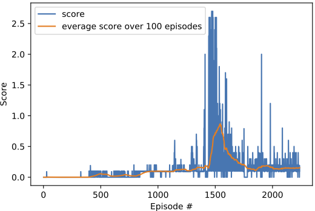

## Overview
For this project, I worked with the [Tennis](https://github.com/Unity-Technologies/ml-agents/blob/master/docs/Learning-Environment-Examples.md#tennis) environment.
In this environment, two agents control rackets to bounce a ball over a net. If an agent hits the ball over the net, it receives a reward of +0.1.  If an agent lets a ball hit the ground or hits the ball out of bounds, it receives a reward of -0.01.  Thus, the goal of each agent is to keep the ball in play.

The observation space consists of 8 variables corresponding to the position and velocity of the ball and racket. Each agent receives its own, local observation.  Two continuous actions are available, corresponding to movement toward (or away from) the net, and jumping. 

### Solving the Environment

The task is episodic, the environment is considered solved, when the average (over 100 episodes) of those **scores** is at least +0.5.

##### Learning algorithm.
For solving the environment I used Deep Deterministic Policy Gradients (DDPG) algorithm expanded to the multi-agent setup. DDPG is an actor-critic, model free approach designed for continuous spaces. DDPG combines an actor model that learns an optimal policy (predict an action given a state), whereas critic is aimed to estimate the goodness of the predicted action,, that is, the state action value function (*Q* function).

During the training parameters of actor and critic are updated in alternating fashion while making use of experience replay strategy. In intuitive terms, the actor is trained predict actions, tht yield high *Q* value when evaluated by the critic. Since the network being updated also provides the target value, a local copies of the actor and critic models are created to predict the target values in order to avoid instability in training. The weights of the target predicting models are synchronized with the local networks to which the SGD updates are applied by the means of "soft" update strategy (see [original paper](https://arxiv.org/pdf/1509.02971.pdf) for details). 

In the multi-agent setup both agents share the same actor and critic networks as well as a shared replay buffer.

##### Architecture.
Actor and critic feature a simple architecture containing two fully connected layers (128 nodes each) endowed with ReLU activations and Batch-Normalization layers in between. 
#### Hyperparameters

Main hyperparameters of the learning algorithm can be found in *ddpg_agent.py*, these were tuned to perform well on the given environment and include:

- BUFFER_SIZE = int(1e6)  # replay buffer size
- BATCH_SIZE = 256  - minibatch size
- GAMMA = 0.9  - discount factor
- TAU = 1e-3  - for soft update of target parameters
- LR_ACTOR = 0.003 - learning rate of the actor
- LR_CRITIC = 0.004 - learning rate of the critic
- WEIGHT_DECAY = 0  - L2 weight decay
- SIGMA = 0.2 - sigma parameter of the noise process, regulates how much noise is added to the policy decision

#### Results
In the training the agent is able to obtain an average score of up to +0.9 (over 100 consecutive episodes) after 1500 episodes.

The following graph shows the dynamics of the average score (over 100 consecutive episodes) as well as current score is presented. Here, the x-axis corresponds to the episode number and the y-axis to the score.

## Future Work includes:
- Solving the more difficult "Play Soccer" environment
- Further hyperparameter tuning could improve the learning speed and stability of the model (prevent performance decrease after 1600 episodes)